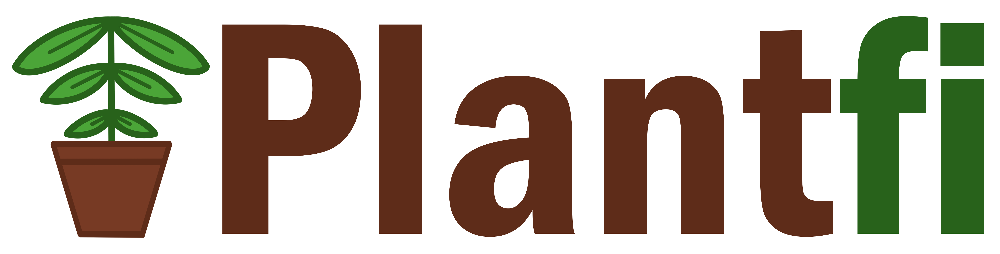

# Plantfi

**Note: I only uploaded the code I wrote in Arduino and Flutter not the dependencies as well**

## Why did I make Plantfi?

The main inspiration for Plantfi came from my newfound hobby of taking care of houseplants, which I discovered during the last year and a half. I recently realized that I will often just water my plants without really having a logical reason to it, other that the top soil being a little dry. This has led to quite a few accidental plant deaths from over-watering. I thought the best way to eliminate this problem would be to create an IoT device that communicates with my phone to tell me _exactly_ when my plants need water.

## What it does

The project focuses on two key components: arduino and an app. For the arduino focus, I put together a smal IoT device that uses a capacitative soil moisture sensor to get moisture percentage in soil. The data from the sensor is sent to a realtime Firebase database that constantly updates with new information. For the app, I created an engaging anf fun app using Flutter. The app shows the moisture valuee while also adding a bit of a flare like plant naming, custom drawn plant icons, and soon much more!

### Possible areas of application:

- Plant health tracker to see your houseplants' health
- Soil monitor for a community garden plot
- Moisture measuring for an experimental plant on Mars
- Much more!

## Ingredients

I utilized the Arduino IDE to write and deploy code for the arduino device. I used Firebase as my cloud database solution. I also made use of Figma to make a basic mockup, and Flutter to create my app.

## Challenges

The main challenged I encountered during the hackathon was putting all the components together. I approached the project by breaking everything down into pieces and getting pieces working before focusing on the overall. Once I had all componets working, I spent over 6 hours putting it all together and debugging the many little issues that showed up. Other than that my only other challenge was trying not to spill wet soil or water on my arduino parts.

## What I am proud of

I am honestly proud of all that I managed to accomplish in the span of this hackathon. This was my first time doing a solo hackathon, so I was not sure how much I could do, but I am really happy with all I finished!

## What I learned

I am leaving this hackathon with quite a few new skills. I learned how to use Firebase, how to create an app using Flutter, and how to connect arduino to a mobile app.

## What is next?

With more time and labor, I hope to take Plantfi and turn it into something a lot more feature packed. My goal is to add more metric obtaining functionality to the hardware, and then to make the app even more engaging!